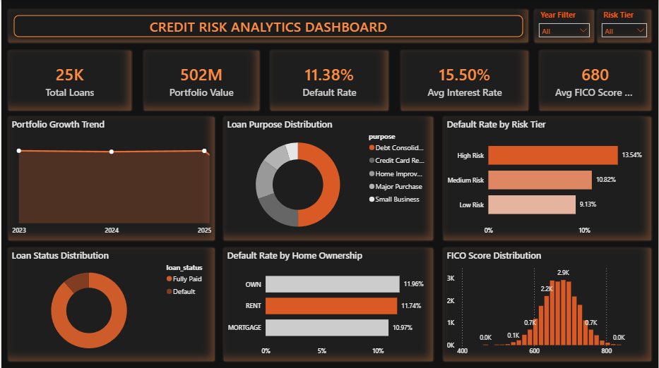
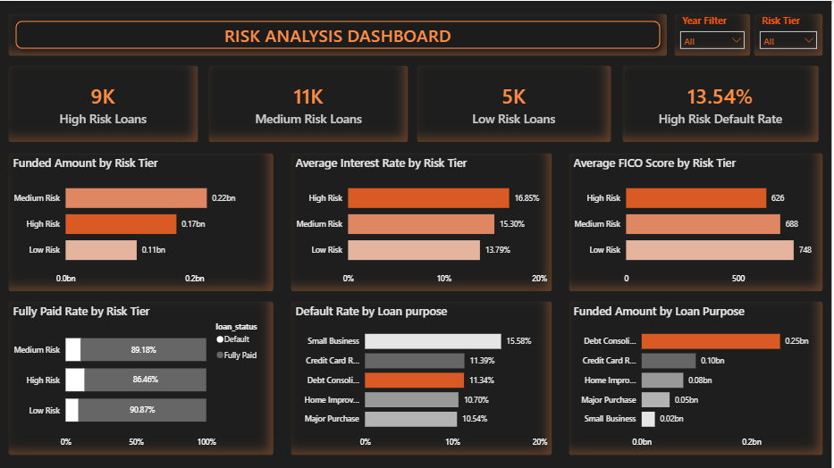
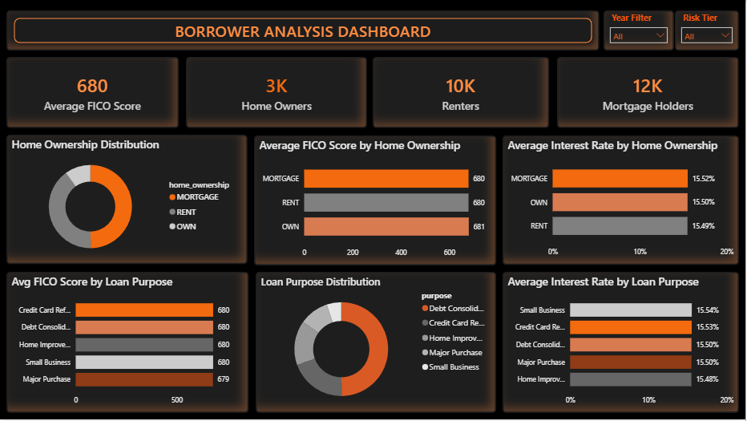

# Credit Risk Analytics Dashboard

## Project Overview

This project analyzes a loan portfolio of 25,000 borrowers to identify credit risk patterns, borrower behavior, portfolio quality, and financial exposure. The project combines SQL, Python, Feature Engineering, and Power BI to deliver business insights through an interactive dashboard.

---

## Business Problem

Financial institutions must assess borrower risk accurately to reduce defaults and improve lending decisions.

This project helps answer:

- Which borrower segments carry the highest risk?
- How does credit score impact default probability?
- What is the distribution of loan quality across the portfolio?
- Which income groups generate the highest exposure?
- How can risk segmentation improve lending decisions?

---

## Dataset

The dataset contains 25,000 synthetic loan records with information such as:

- Borrower demographics
- Income
- Credit score
- Loan amount
- Loan purpose
- Interest rate
- Employment status
- Debt-to-income ratio
- Default status

---

## Project Workflow

### 1. Data Generation

Synthetic loan portfolio generated using Python.

Notebook:

`notebooks/Credit_Risk_Data_Gen.ipynb`

### 2. Feature Engineering

Created additional risk-focused variables such as:

- Risk Tier
- Income Segmentation
- Credit Score Buckets
- Loan-to-Income Metrics

Notebook:

`notebooks/feature_engineering.py.ipynb`

### 3. SQL Analysis

Performed portfolio analysis using SQL.

Examples:

- Portfolio Summary
- Risk Segmentation
- Default Analysis
- Loan Purpose Analysis
- Income Distribution Analysis

SQL File:

`sql/credit_risk_analysis.sql`

### 4. Power BI Dashboard

Developed an interactive dashboard consisting of:

- Executive Overview
- Risk Analysis
- Borrower Analysis

Power BI File:

`powerbi/Credit_Risk_Analytics.pbix`

---

# Dashboard Screenshots

## Executive Overview



## Risk Analysis



## Borrower Analysis



---

## Tools Used

- Python
- Pandas
- NumPy
- SQL
- Power BI
- GitHub

---

## Key Insights

- Identified high-risk borrower segments.
- Measured portfolio exposure across risk tiers.
- Analyzed borrower demographics and income patterns.
- Evaluated credit score impact on default probability.
- Developed an executive-level dashboard for decision-making.

---

## Repository Structure

```text
credit-risk-analytics-project
│
├── data
├── images
├── notebooks
├── powerbi
├── sql
└── README.md
```

---

## Author

**Shadab Kazi**

BBA (Finance) | Data Analytics | Power BI | SQL | Python
